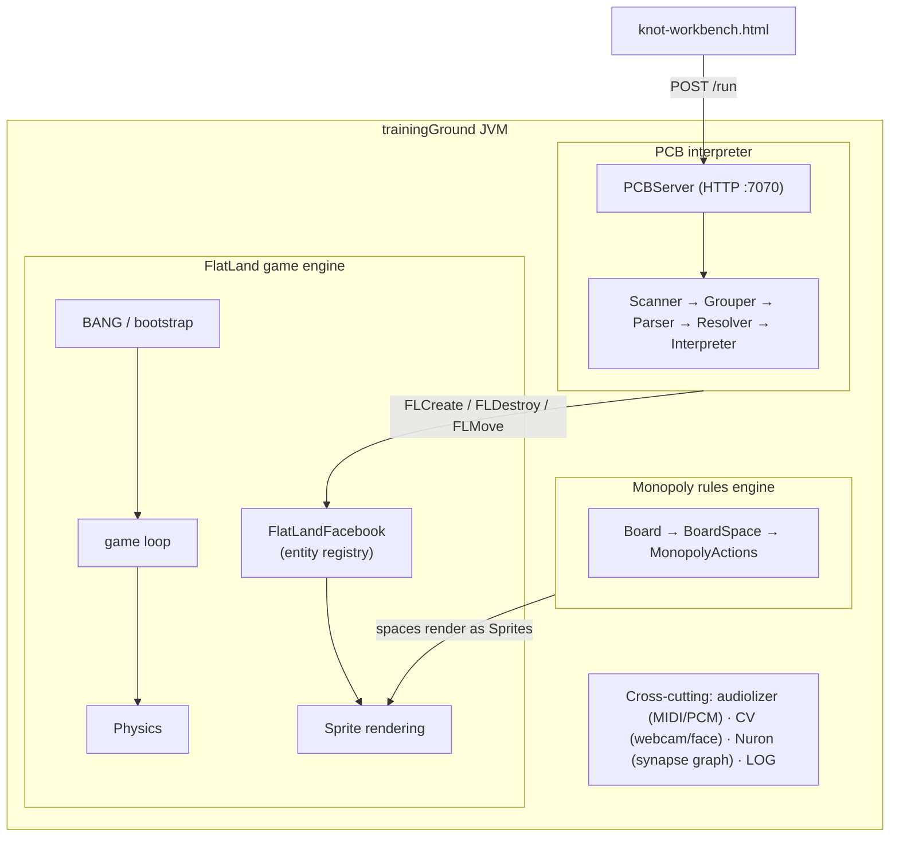

# trainingGround — E><3

> Three systems sharing one JVM, deliberately interwoven: a 2D game engine, a
> hand-written programming language, and a Monopoly rules engine — explored
> under a theme of recovery, renewal, and hope.

`trainingGround` is an ambitious experiment in what it means for code to be
*alive* and *active*. It is **one Maven project containing three interlocking
systems**:

1. **FlatLand** — a 2D tile-based game engine: entities, physics, sprites, levels, and a game loop.
2. **PCB (Pocket / Cup / Box)** — a complete custom scripting language, written from scratch: scanner → grouper → parser → resolver → interpreter → environment, with its own vector/matrix math sub-language and an HTTP server.
3. **A Monopoly rules engine** — a full board-game ruleset embedded in the same runtime.

These aren't loosely-coupled plugins. **PCB scripts reach into the live game
world** to create, destroy, and move FlatLand entities at runtime; the Monopoly
engine renders its board through FlatLand's sprite pipeline; and the PCB
interpreter is exposed over HTTP so it can be driven from browser tooling.

> 📖 **Full deep-dive:** [`TECHNICAL_DOCUMENTATION.md`](TECHNICAL_DOCUMENTATION.md) —
> a ~62,000-line, 298-file codebase documented across 19 chapters (engine,
> language internals, data-flow diagrams, design choices). The README is the
> doorway; that document is the house.

---

## The headline: PCB is a real language

PCB isn't a config format or a DSL wrapper — it's a hand-built interpreter with a
genuine front-to-back pipeline:

```
Scanner ─► Grouper ─► Parser ─► Resolver ─► Interpreter ─► Environment
(lexing)  (2nd-pass   (AST)     (static     (execution)    (lexical
           grouping)             analysis)                  scopes)
```

Its most unusual feature is **bidirectional execution via reversed keywords**:
every keyword has a mirrored spelling — `print`/`tnirp`, `run`/`nur`, `if`/`fi` —
with their own token types and interpreter visit methods. It's an intentional,
systematic language-design choice, not a gimmick.

The interpreter also runs as an HTTP server (`PCBServer`, port `7070`, `POST
/run`), which is what [`knot-workbench.html`](knot-workbench.html) — the "PCB
Knot Workbench" — talks to.

---

## Architecture



| Integration point | How |
|---|---|
| PCB → game world | `FLCreate` / `FLDestroy` / `FLMove` / `FLSetValue` AST nodes call into the entity registry |
| Monopoly → FlatLand | `MonopolySpace` implements the `Sprites` interface, rendered by the FlatLand pipeline |
| Workbench → interpreter | HTTP `POST /run` invokes `sandbox.runJson()` |

### Selected subsystems

| Area | Package(s) | What it does |
|---|---|---|
| Language core | `Box/Interpreter`, `Box/Scanner`, `Box/Grouper`, `Box/Syntax`, `Box/Token` | The PCB pipeline and runtime |
| Math sub-language | `Box/math` | Scalar, vector, and matrix operations with its own scanner/parser |
| Game engine | `FlatLander/`, `FlatLand/Physics/`, `Sprites/`, `View/`, `GameView/` | Entities, physics, rendering, game loop |
| Monopoly | `TheGame/`, `Rules/`, `MonopolyActions/`, `Island/` | Board, spaces, rules, actions |
| Cross-cutting | `audiolizer/`, `CV/`, `Nuron/` | Audio synthesis, computer vision, synapse graph |

---

## Building & running

**Requirements:** Java 21, Maven.

> ⚠️ **Heads-up — this project does not build standalone yet.** It depends on
> five local `SNAPSHOT` libraries that must be built and `mvn install`ed into
> your local Maven repo first: `LOGGING`, `AntAnimation`, `the:VectorServer`,
> `BoardTemplate`, and `ScreenIntegration`. It also pulls `javacv-platform`
> (bundled native OpenCV — a large download). This is pre-release research code,
> not a turnkey build.

Once the local dependencies are present:

```bash
mvn clean package      # shaded jar, mainClass theStart.StartingPoint
```

- **Game:** `theStart.BANG` is the interactive entry point — it prompts for canvas
  size, a random seed (`0–16777215`, the 24-bit color range), and neuron count,
  then opens the Swing game window. See §4 of the technical doc for the full
  bootstrap sequence.
- **PCB workbench:** start the interpreter's `PCBServer` (HTTP `:7070`) and open
  `knot-workbench.html` to drive the language from the browser.

---

## Status

This is **active, pre-release research code** (`0.0.1-SNAPSHOT`), and the
documentation is refreshingly honest about it — several subsystems are scaffolded
but not fully implemented, some packages (`PCB/`, `PCBDEFINITION/`) are
intentional placeholders, and `*OLD` files are kept deliberately to preserve the
evolution of the parser. The technical doc's §18 ("Notable Design Choices &
Quirks") catalogs the sharp edges directly rather than hiding them — including
the "Commie Chest" Monopoly rename and the bidirectional-keyword system.

If you want to understand the codebase, **start with
[`TECHNICAL_DOCUMENTATION.md`](TECHNICAL_DOCUMENTATION.md)** — it is unusually
complete and is the best map of what's here.

---

## License

See [LICENSE](LICENSE).

---

Built by **brackishbert** · [github.com/brackishbert-coder/trainingGround](https://github.com/brackishbert-coder/trainingGround)
